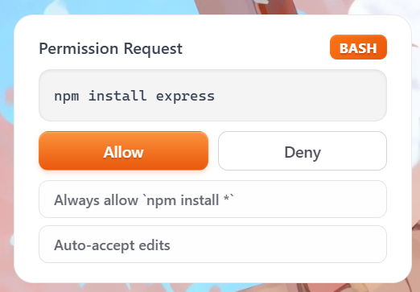
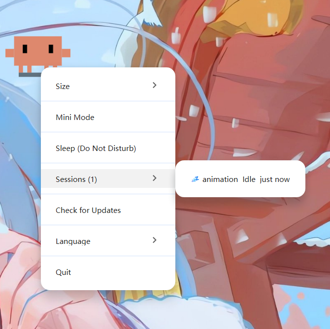

<p align="center">
  
</p>
<h1 align="center">Clawd on Desk</h1>
<p align="center">
  <a href="README.zh-CN.md">中文版</a>
</p>

A desktop pet that reacts to your AI coding agent sessions in real-time. Clawd lives on your screen — thinking when you prompt, typing when tools run, juggling subagents, reviewing permissions, celebrating when tasks complete, and sleeping when you're away.

> Supports Windows 11 and macOS. Requires Node.js. Works with **Claude Code**, **Codex CLI**, and **Copilot CLI**.

## Features

### Multi-Agent Support
- **Claude Code** — full integration via command hooks + HTTP permission hooks
- **Codex CLI** — automatic JSONL log polling (`~/.codex/sessions/`), no configuration needed
- **Copilot CLI** — command hooks via `~/.copilot/hooks/hooks.json`
- **Multi-agent coexistence** — run all three simultaneously; Clawd tracks each session independently

### Animations & Interaction
- **Real-time state awareness** — agent hooks and log polling drive Clawd's animations automatically
- **12 animated states** — idle, thinking, typing, building, juggling, conducting, error, happy, notification, sweeping, carrying, sleeping
- **Eye tracking** — Clawd follows your cursor in idle state, with body lean and shadow stretch
- **Sleep sequence** — yawning, dozing, collapsing, sleeping after 60s idle; mouse movement triggers a startled wake-up animation
- **Click reactions** — double-click for a poke, 4 clicks for a flail
- **Drag from any state** — grab Clawd anytime (Pointer Capture prevents fast-flick drops), release to resume
- **Mini mode** — drag to right edge or right-click "Mini Mode"; Clawd hides at screen edge with peek-on-hover, mini alerts/celebrations, and parabolic jump transitions

### Permission Bubble



- **In-app permission review** — when Claude Code requests tool permissions, Clawd pops a floating bubble card instead of waiting in the terminal
- **Allow / Deny / Suggestions** — one-click approve, reject, or apply permission rules (e.g. "Always allow Read")
- **Stacking layout** — multiple permission requests stack upward from the bottom-right corner
- **Auto-dismiss** — if you answer in the terminal first, the bubble disappears automatically

### Session Intelligence



- **Multi-session tracking** — sessions across all agents resolve to the highest-priority state
- **Subagent awareness** — juggling for 1 subagent, conducting for 2+
- **Terminal focus** — right-click Clawd → Sessions menu to jump to a specific session's terminal window; notification/attention states auto-focus the relevant terminal
- **Process liveness detection** — detects crashed/exited agent processes (Claude Code, Codex, Copilot) and cleans up orphan sessions
- **Startup recovery** — if Clawd restarts while any agent is running, it stays awake instead of falling asleep

### System
- **Click-through** — transparent areas pass clicks to windows below; only Clawd's body is interactive
- **Position memory** — Clawd remembers where you left it across restarts (including mini mode)
- **Single instance lock** — prevents duplicate Clawd windows
- **Auto-start** — Claude Code's SessionStart hook can launch Clawd automatically if it's not running
- **Do Not Disturb** — right-click or tray menu to enter sleep mode; all hook events are silenced until you wake Clawd
- **System tray** — resize (S/M/L), DND mode, language switch, auto-start, check for updates
- **i18n** — English and Chinese UI; switch via right-click menu or tray
- **Auto-update** — checks GitHub releases; Windows installs NSIS updates on quit, macOS opens the release page

## State Mapping

Events from all agents (Claude Code hooks, Codex JSONL, Copilot hooks) map to the same animation states:

| Agent Event | Clawd State | Animation | |
|---|---|---|---|
| Idle (no activity) | idle | Eye-tracking follow |  |
| UserPromptSubmit | thinking | Thought bubble |  |
| PreToolUse / PostToolUse | working (typing) | Typing |  |
| PreToolUse (3+ sessions) | working (building) | Building |  |
| SubagentStart (1) | juggling | Juggling |  |
| SubagentStart (2+) | conducting | Conducting |  |
| PostToolUseFailure / StopFailure | error | ERROR + smoke |  |
| Stop / PostCompact | attention | Happy bounce |  |
| PermissionRequest / Notification | notification | Alert jump |  |
| PreCompact | sweeping | Broom sweep |  |
| WorktreeCreate | carrying | Carrying box |  |
| 60s no events | sleeping | Sleep sequence |  |

### Mini Mode

Drag Clawd to the right screen edge (or right-click → "Mini Mode") to enter mini mode. Clawd hides behind the screen edge with half-body visible, peeking out when you hover.

| Trigger | Mini Reaction | |
|---|---|---|
| Default | Breathing + blinking + occasional arm wobble + eye tracking |  |
| Hover | Peek out + wave (slides 25px into screen) |  |
| Notification / PermissionRequest | Exclamation mark pop + >< squint eyes |  |
| Stop / PostCompact | Flower + ^^ happy eyes + sparkles |  |
| Click during peek | Exit mini mode (parabolic jump back) | |

## Quick Start

```bash
# Clone the repo
git clone https://github.com/rullerzhou-afk/clawd-on-desk.git
cd clawd-on-desk

# Install dependencies
npm install

# Start Clawd (auto-registers Claude Code hooks on launch)
npm start
```

### Agent Setup

**Claude Code** — works out of the box. Hooks are auto-registered on launch. Versioned hooks (`PreCompact`, `PostCompact`, `StopFailure`) are registered only when Clawd can positively detect a compatible Claude Code version; if detection fails (common for packaged macOS launches), Clawd falls back to core hooks and removes stale incompatible versioned hooks automatically.

**Codex CLI** — works out of the box. Clawd polls `~/.codex/sessions/` for JSONL logs automatically.

**Copilot CLI** — create `~/.copilot/hooks/hooks.json`:
```json
{
  "version": 1,
  "hooks": {
    "sessionStart": [{ "type": "command", "bash": "node /path/to/clawd-on-desk/hooks/copilot-hook.js sessionStart", "powershell": "node /path/to/clawd-on-desk/hooks/copilot-hook.js sessionStart", "timeoutSec": 5 }],
    "userPromptSubmitted": [{ "type": "command", "bash": "node /path/to/clawd-on-desk/hooks/copilot-hook.js userPromptSubmitted", "powershell": "node /path/to/clawd-on-desk/hooks/copilot-hook.js userPromptSubmitted", "timeoutSec": 5 }],
    "preToolUse": [{ "type": "command", "bash": "node /path/to/clawd-on-desk/hooks/copilot-hook.js preToolUse", "powershell": "node /path/to/clawd-on-desk/hooks/copilot-hook.js preToolUse", "timeoutSec": 5 }],
    "postToolUse": [{ "type": "command", "bash": "node /path/to/clawd-on-desk/hooks/copilot-hook.js postToolUse", "powershell": "node /path/to/clawd-on-desk/hooks/copilot-hook.js postToolUse", "timeoutSec": 5 }],
    "sessionEnd": [{ "type": "command", "bash": "node /path/to/clawd-on-desk/hooks/copilot-hook.js sessionEnd", "powershell": "node /path/to/clawd-on-desk/hooks/copilot-hook.js sessionEnd", "timeoutSec": 5 }]
  }
}
```
Replace `/path/to/clawd-on-desk` with your actual install path.

### Remote SSH (Claude Code & Codex CLI)


Clawd can sense AI agent activity on remote servers via SSH reverse port forwarding. Hook events and permission requests travel through the SSH tunnel back to your local Clawd — no code changes needed on the Clawd side.

**One-click deploy:**

```bash
bash scripts/remote-deploy.sh user@remote-host
```

This copies hook files to the remote server, registers Claude Code hooks in remote mode, and prints SSH configuration instructions.

**SSH configuration** (add to your local `~/.ssh/config`):

```
Host my-server
    HostName remote-host
    User user
    RemoteForward 127.0.0.1:23333 127.0.0.1:23333
    ServerAliveInterval 30
    ServerAliveCountMax 3
```

**How it works:**
- **Claude Code** — command hooks on the remote server POST state changes to `localhost:23333`, which the SSH tunnel forwards back to your local Clawd. Permission bubbles work too — the HTTP round-trip goes through the tunnel.
- **Codex CLI** — a standalone log monitor (`codex-remote-monitor.js`) polls JSONL files on the remote server and POSTs state changes through the same tunnel. Start it on the remote: `node ~/.claude/hooks/codex-remote-monitor.js --port 23333`

Remote hooks run in `CLAWD_REMOTE` mode which skips PID collection (remote PIDs are meaningless locally). Terminal focus is not available for remote sessions.

> Thanks to [@Magic-Bytes](https://github.com/Magic-Bytes) for the original SSH tunneling idea ([#9](https://github.com/rullerzhou-afk/clawd-on-desk/issues/9)).

### macOS Notes

- **From source** (`npm start`): works out of the box on Intel and Apple Silicon.
- **DMG installer**: the app is not signed with an Apple Developer certificate, so macOS Gatekeeper will block it. To open:
  - Right-click the app → **Open** → click **Open** in the dialog, or
  - Run `xattr -cr /Applications/Clawd\ on\ Desk.app` in Terminal.

## How It Works

```
Claude Code / Copilot CLI (command hooks, non-blocking):
  Agent event
    → hooks/clawd-hook.js or copilot-hook.js (event → state → HTTP POST)
    → 127.0.0.1:23333/state
    → State machine in main.js (multi-session + priority + min display time)
    → IPC to renderer.js (SVG preload + crossfade swap)

Codex CLI (JSONL log polling):
  Codex writes to ~/.codex/sessions/YYYY/MM/DD/rollout-*.jsonl
    → agents/codex-log-monitor.js (incremental read, event mapping)
    → Same state machine → same animations

Permission review (Claude Code HTTP hook, blocking):
  Claude Code PermissionRequest
    → HTTP POST to 127.0.0.1:23333/permission
    → Bubble window (bubble.html) with Allow / Deny / suggestion buttons
    → User clicks → HTTP response → Claude Code proceeds
```

Clawd runs as a transparent, always-on-top, unfocusable Electron window with per-region click-through. It never steals focus or blocks your workflow — clicks on transparent areas pass straight through to the window below.

## Manual Testing

```bash
# Trigger a specific state
curl -X POST http://127.0.0.1:23333/state \
  -H "Content-Type: application/json" \
  -d '{"state":"working","session_id":"test"}'

# Cycle through all animations (8s each)
bash test-demo.sh

# Cycle through mini mode animations
bash test-mini.sh
```

## Project Structure

```
src/
  main.js            # Electron main: state machine, HTTP server, window, tray, cursor polling
  renderer.js        # Renderer: drag, click reactions, SVG switching, eye tracking
  preload.js         # IPC bridge (contextBridge)
  bubble.html        # Permission bubble UI (tool name, command preview, Allow/Deny/suggestions)
  preload-bubble.js  # Bubble window IPC bridge
  index.html         # Main window page structure
agents/
  claude-code.js     # Claude Code agent config (event map, process names, capabilities)
  codex.js           # Codex CLI agent config (JSONL log event map, poll settings)
  copilot-cli.js     # Copilot CLI agent config (camelCase event map)
  registry.js        # Agent registry (lookup by ID or process name)
  codex-log-monitor.js # Codex JSONL incremental log polling
hooks/
  clawd-hook.js      # Claude Code command hook (zero deps, <1s, event → state → HTTP POST)
  copilot-hook.js    # Copilot CLI command hook (camelCase events, same architecture)
  install.js         # Safe hook registration into ~/.claude/settings.json (append, never overwrite)
  auto-start.js      # SessionStart hook: launches Clawd if not running (<500ms)
  codex-remote-monitor.js  # Standalone Codex JSONL poller for remote servers (HTTP POST via SSH tunnel)
  server-config.js   # Shared port discovery + HTTP helpers (used by all hooks)
scripts/
  remote-deploy.sh   # One-click remote hook deployment via SSH
extensions/
  vscode/            # VS Code extension for terminal tab focus via URI protocol
assets/
  svg/               # 40 pixel-art SVG animations with CSS keyframes (incl. 8 mini mode)
  gif/               # Recorded GIFs for documentation
```

## Known Limitations

| Limitation | Details |
|---|---|
| **Codex CLI: no terminal focus** | Codex sessions use JSONL log polling which doesn't carry terminal PID info. Clicking Clawd won't jump to the Codex terminal. Claude Code and Copilot CLI work fine. |
| **Codex CLI: Windows hooks disabled** | Codex hardcodes hooks off on Windows, so we poll log files instead. This means ~1.5s latency vs near-instant for hook-based agents. |
| **Copilot CLI: manual hook setup** | Copilot hooks require manually creating `~/.copilot/hooks/hooks.json`. Claude Code and Codex work out of the box. |
| **Copilot CLI: no permission bubble** | Copilot's `preToolUse` hook only supports deny, not the full allow/deny flow. Permission bubbles only work with Claude Code. |
| **macOS auto-update** | No Apple code signing — macOS users must download updates manually from GitHub Releases. |
| **No test framework for Electron** | Unit tests cover agents and log polling, but the Electron main process (state machine, windows, tray) has no automated tests. |

### Roadmap

Some things we'd like to explore in the future:

- Codex terminal focus via process tree lookup from `codex.exe` PID
- Auto-registration of Copilot CLI hooks (like we do for Claude Code)
- Sound effects for state transitions (blocked by Electron autoplay policy)
- Custom character skins / animations
- Hook uninstall script for clean app removal

## Contributing

Clawd on Desk is a community-driven project. Bug reports, feature ideas, and pull requests are all welcome — open an [issue](https://github.com/rullerzhou-afk/clawd-on-desk/issues) to discuss or submit a PR directly.

### Contributors

Thanks to everyone who has helped make Clawd better:

<a href="https://github.com/PixelCookie-zyf"></a>
<a href="https://github.com/yujiachen-y"></a>
<a href="https://github.com/AooooooZzzz"></a>
<a href="https://github.com/purefkh"></a>
<a href="https://github.com/Tobeabellwether"></a>
<a href="https://github.com/Jasonhonghh"></a>
<a href="https://github.com/crashchen"></a>
<a href="https://github.com/InTimmyDate"></a>

## Acknowledgments

- Clawd pixel art reference from [clawd-tank](https://github.com/marciogranzotto/clawd-tank) by [@marciogranzotto](https://github.com/marciogranzotto)
- The Clawd character is the property of [Anthropic](https://www.anthropic.com). This is a community project, not officially affiliated with or endorsed by Anthropic.

## License

MIT
