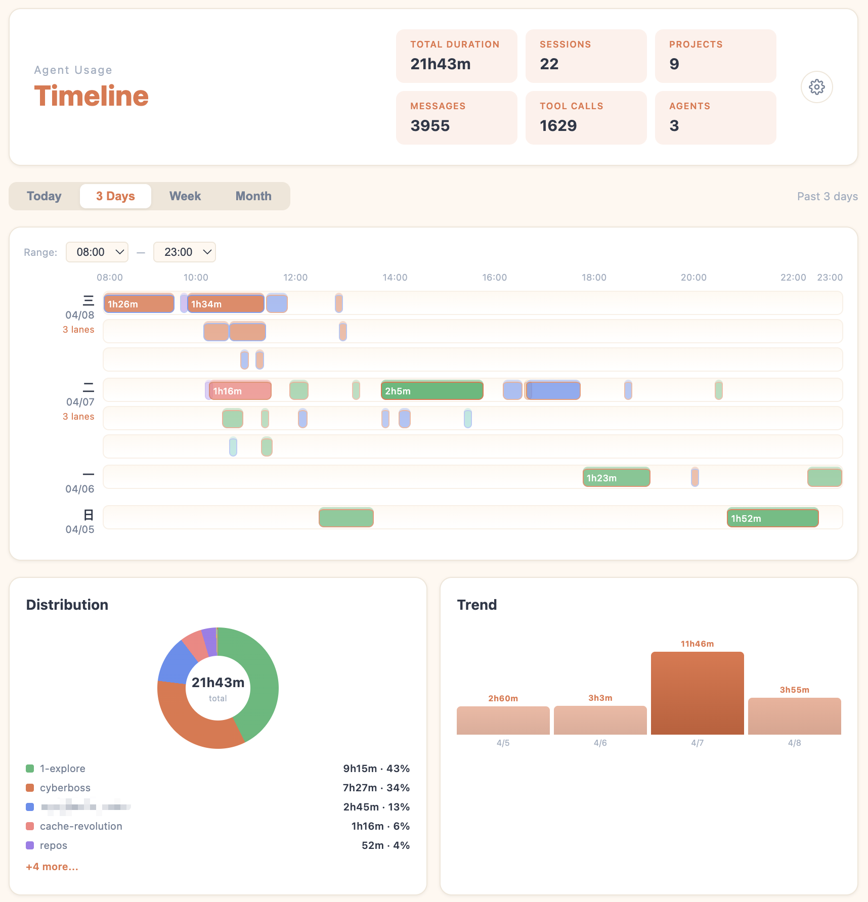
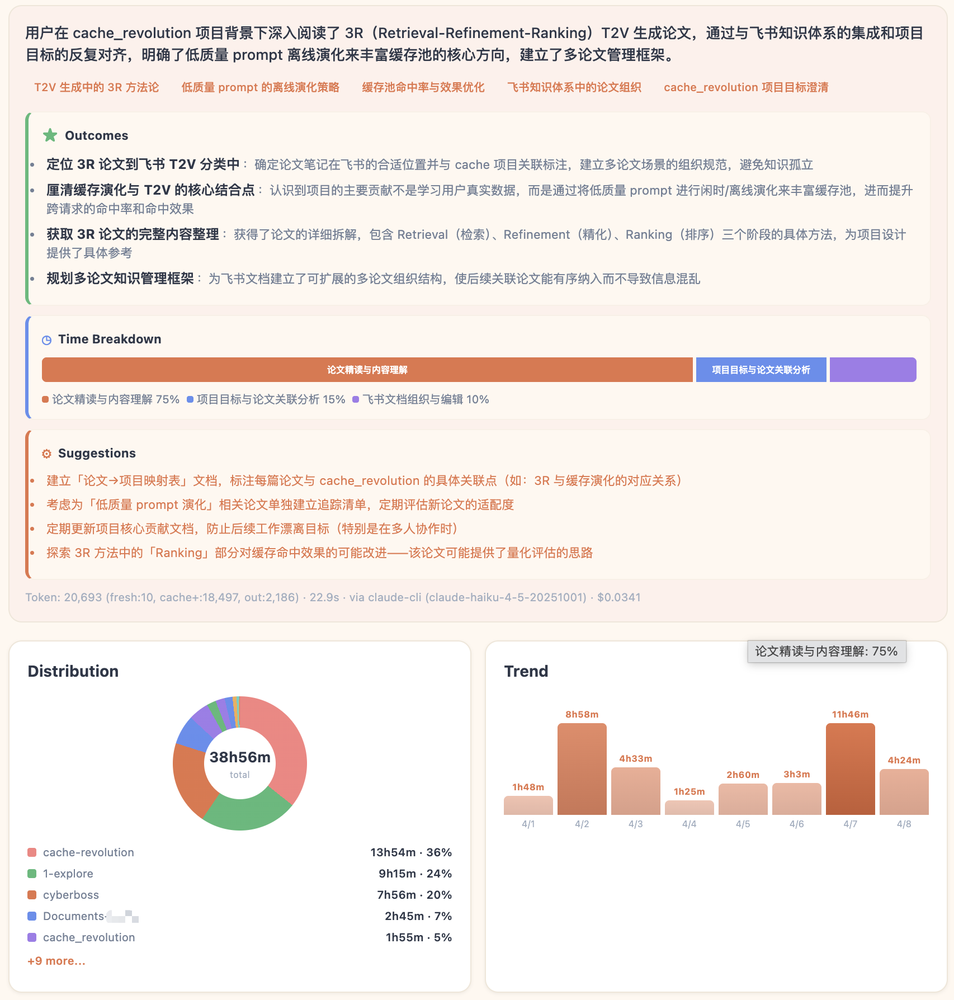
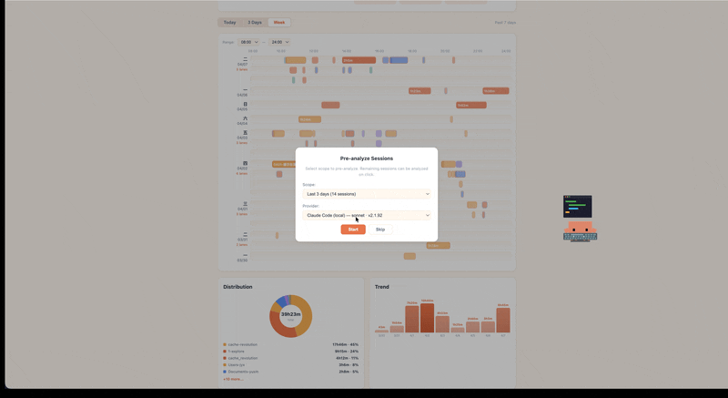
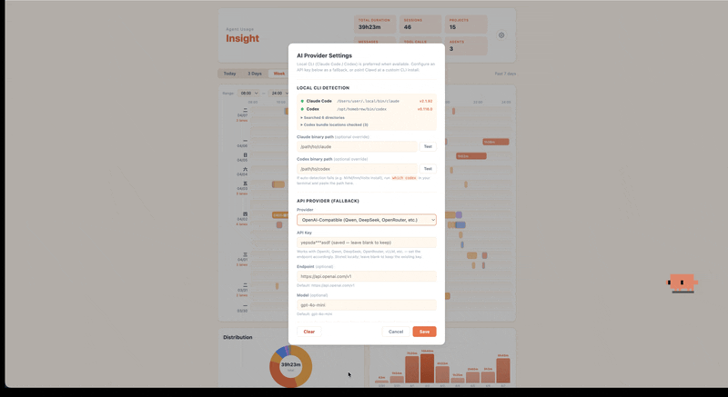
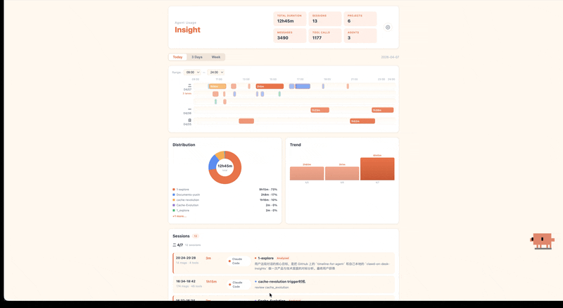

<div align="center">

# clawd-on-desk-insights
## 本地优先的 AI 编程会话分析面板

> "在你和 Agent 的对话中——什么正在浮现?"

[](#为什么需要它)
[](./LICENSE)
[-111827)](#上手指南)
[](#上手指南)
[](#关于-fork-仓的说明)

<p>
  <a href="#快速安装">安装</a> ·
  <a href="#功能特性">能力</a> ·
  <a href="#上手指南">上手</a> ·
  <a href="#它是怎么工作的">原理</a> ·
  <a href="#常见问题">FAQ</a> ·
  <a href="README.md">English</a>
</p>

</div>

<table align="center">
  <tr>
    <td width="50%" align="center" valign="top">
      
      <br /><sub><b>时间线视图</b> —— 每段会话的轨迹</sub>
    </td>
    <td width="50%" align="center" valign="top">
      
      <br /><sub><b>AI 会话复盘</b> —— 你的尝试和收获</sub>
    </td>
  </tr>
</table>


**这是Agent会话分析面板。** 它将自动扫描你和 Claude Code、Codex、Cursor 等 Agent 已经进行的对话,生成时间线和会话智能分析摘要。再也不用翻漫长的对话历史,clawd-on-desk-insights 将帮你快速整理知识卡片。

每一段对话都留下了**痕迹**,所有你尝试的想法、解决的 bug、和 Agent 讨论做出的决定,都将在 **Analytics Dashboard** 中一一呈现。

数据全部留在本地。AI 分析通过你自己的本地 `claude` / `codex` CLI(或者你配置的 API / Ollama 后端)完成,你的对话不被第三方获取。

> 现阶段主要支持 macOS。Windows/Linux 可能可以运行，但还不是主支持环境。需要 Node.js。

## 快速安装

```bash
git clone https://github.com/yx0716/clawd-on-desk-insights.git
cd clawd-on-desk-insights
npm install
npm start
```

启动后桌面上出现一只小螃蟹——在 macOS 上可右键它打开 **Analytics Dashboard**。详细的 Provider 配置和分析触发方式见下方[上手指南](#上手指南)。


## 功能特性

| 能力 | 说明 |
|---|---|
| **时间线视图** | 按日期 / 项目 / Agent / 时长可视化所有会话——一眼看清自己什么时候在忙什么、忙了多久 |
| **本地历史扫描** | 直接读 `~/.claude/projects/`、`~/.codex/sessions/`、`~/.cursor/projects/`,不上传、无遥测 |
| **AI 会话复盘** | 从**用户视角**总结每段对话:你想做什么、最后拿到了什么、关键话题、时间分配 |
| **灵活分析后端** | 本地 `claude` CLI、本地 `codex` CLI,或回退到你配置的 API provider / Ollama——你的选择,你的 key |
| **批量预分析** | 对最近会话批量预生成摘要,按 provider 隔离的缓存可复用 |
| **成本追踪** | 显示每次 AI 分析的 token 用量与费用 |
| **快捷入口** | 托盘菜单、右键桌面宠物或快捷键一键打开 |

### 使用示例

<table align="center">
  <tr>
    <td width="25%" align="center" valign="top">
      
      <br /><sub><b>① 打开</b><br/>右键 → Dashboard</sub>
    </td>
    <td width="25%" align="center" valign="top">
      
      <br /><sub><b>② 选 Provider</b><br/>本地 CLI / API / Ollama</sub>
    </td>
    <td width="25%" align="center" valign="top">
      
      <br /><sub><b>③ 改设置</b><br/>齿轮 ⚙ → AI Provider</sub>
    </td>
    <td width="25%" align="center" valign="top">
      
      <br /><sub><b>④ 跑分析</b><br/>批量或按需点单条</sub>
    </td>
  </tr>
</table>

## 上手指南

### 1. 安装并启动

```bash
git clone https://github.com/yx0716/clawd-on-desk-insights.git
cd clawd-on-desk-insights
npm install
npm start
```

启动后桌面右下角会出现一只小螃蟹(默认主题),它就是 Clawd 桌面宠物。**洞察面板的入口都通过它**。

### 2. 打开 Analytics Dashboard

有三种方式可以打开洞察面板,选你顺手的:

- **右键点击桌面宠物** → 在弹出菜单中选 **Analytics Dashboard**
- **点击托盘图标**(macOS 顶部菜单栏) → **Analytics Dashboard**
- **快捷键**:macOS `⌘ + Shift + Option + A`

<p align="center">
  
</p>

第一次打开就能立刻看到时间线视图——它直接读你硬盘上已有的会话日志,**不需要任何配置**。

### 3.配置 AI Provider, 启用会话摘要

时间线本身是开箱即用的,但要让面板自动**生成每段会话的复盘摘要**,需要告诉它一个能调用大模型的入口， **AI Provider**(分析后端)。具体而言，有以下三种配置选择：

| Provider 类型 | 是什么 | 怎么配置 | 适合谁 |
|---|---|---|---|
| **本地 CLI**(推荐) | 复用你已经装在电脑上的 `claude`(Claude Code)或 `codex` 命令行 | **不用配**,面板会自动检测 | 已经在用 Claude Code / Codex 订阅的人——使用订阅内的额度，无额外开销 |
| **API Key** | Anthropic、OpenAI 等服务商的 API key,按 token 计费 | 在面板设置里粘贴 key | 没装本地 CLI、又愿意为分析付一点 token 费用 |
| **Ollama** | 本地跑的开源模型服务(如 Ollama) | 在设置里填本地 endpoint | 想完全离线、不发送任何数据到云端 |

> **💡 强烈推荐**:如果你电脑上已经装了 Claude Code 或 Codex CLI,**直接什么都不用配**——面板会自动找到它们,直接复用你已有的订阅额度。这是最省事也最便宜的方案。

如果暂时还不想配置，可以在启动界面点选 Skip，后续也可以随时在设置里配置。
<p align="center">
  
</p>


### 4. 在哪里配置 / 修改 Provider?

如果第 3 步跳过了，或者此后想更换 provider，可以通过 **AI Provider Settings** 进行调整:

打开 Analytics Dashboard → 点右上角的 **齿轮图标 ⚙** → 弹出 **AI Provider Settings** 面板。

<p align="center">
  
</p>

这个面板有两块内容:

- **LOCAL CLI DETECTION**(本地 CLI 自动检测) — 显示面板有没有找到你本地的 `claude` 和 `codex`。绿点 = 找到了,显示版本号和路径;红点 = 没找到。**已显示绿点说明一切正常，可以直接进行下一步**。
- **API PROVIDER (FALLBACK)**(API 备选) — 如果未安装本地 CLI，可以通过 API Key 进行 会话智能分析(Claude / OpenAI / Ollama 等)、粘贴 API key 即可。

> **小提示**:如果你的 `claude` / `codex` 是通过 NVM、fnm、Volta 这类版本管理工具装的,自动检测可能找不到。这时候在终端执行 `which claude` 或 `which codex`,把输出的路径粘贴到上面的 **Claude binary path** / **Codex binary path** 输入框里就行。

### 使用前自检

1. 已在本地使用 `Claude Code`、`Codex` 或 `Cursor Agent`，且当前仍可使用
2. 本地有会话记录 （默认存在）

**快速检查**

- 打开设置,看 `Local CLI Detection`
- 切到 `Week` 或 `Month` 看 timeline 里是否有 session

### 5. 开始 Agent 会话分析

#### 方法 A:批量预分析(开 Dashboard 时弹出)

每次打开 Analytics Dashboard,如果检测到有未分析的会话,面板会**自动弹出一个对话框** —— `Pre-analyze Sessions`,让你一次性把一段时间内的会话全部分析掉。

> **说明**: 面板自身发起的内部 AI 总结任务会自动从时间线和会话统计里排除。即使你是在别的目录执行 `npm start`,这些内部分析任务也不会被算进工作会话。

可选范围:

- **Today** — 今天的所有会话
- **3 Days** — 最近三天
- **Week** — 最近一周
- **Custom** — 自定义最近 N 条

选好之后点确认,面板会显示 `Analyzing 1/N`、`2/N`...的进度条,在后台一条条跑分析。**已经分析过的会话会自动跳过**(按 provider 隔离的缓存),所以重复点击不会浪费 token。
<p align="center">
  
</p>

> **适合谁**:第一次打开面板的新用户、想做一次性月度复盘、批量回顾过去一段时间的工作。

#### 方法 B:点单条会话(timeline / sessions 列表里点击)

如果你**只想看某一个具体 session 的复盘**,不需要批量,可以直接点击:

- **从时间线点** — 在 Timeline 视图里,点击任意一个时间块(色块代表一段会话),右侧会跳出该 session 的详情卡片
- **从 sessions 列表点** — 右侧 Sessions 列表里,点击任意一张会话卡片

无论从哪里点,面板都会:

1. 优先显示**已缓存的摘要**(如果之前批量预分析过,会标 `Analyzed`,直接秒开)
2. 如果还没分析过,**点击会立即触发单条分析**,卡片显示 `Analyzing…` 标签,几秒到几十秒后出结果

<p align="center">
  
</p>


> **适合谁**:已经知道自己想看哪段会话的、临时想起来的查阅、平时按需"刷"历史。

**总体而言**：
- **第一次用** → 建议先跑一次 **方法 A 的 Week**, 选择特定数目/周期的对话进行分析(几分钟,消耗token较多，但之后可以随时秒开记录)
- **日常用** → 跑完一次 多条绘画分析后，日常采用 **方法 B 选择特定对话进行分析** 
- **token 敏感** → 用 **方法 B 按需触发**,只分析你真的想看的那几条,不浪费一分钱

> **关于成本**:本地 CLI(Claude Code / Codex 订阅)分析**走你已有的订阅额度**,通常几乎不需要额外付费。API key 模式下,面板会在每条分析完成后**显示 token 用量和费用**(顶部状态栏),让你心里有数。

## 它是怎么工作的

Clawd 同时跑着两条互不依赖的数据通路:

```
你的 Agent                            Clawd
  │                                    │
  ├── 实时事件 ──→ hook / 轮询 / 插件 ──→ 🦀 桌面宠物动画
  │                                    │
  └── 对话历史 ──→ 本地 JSONL 文件 ────→ 📊 洞察面板
```

### 通路 ①:实时感知 → 桌宠动画

Agent 工作时(调用工具、等待用户输入、报错、完成任务……)会产生事件。Clawd 通过三种方式捕获这些事件,驱动桌面宠物播放对应动画:

| 集成方式 | 原理 | 延迟 | 使用的 Agent |
|---|---|---|---|
| **Command hook** | Agent 触发事件时自动执行一段脚本,脚本通过 HTTP POST 把事件发给 Clawd 本地服务器(`127.0.0.1:23333`) | 近乎零 | Claude Code、Copilot CLI、Gemini CLI、Cursor Agent、Kiro CLI |
| **日志轮询** | Clawd 每 ~1.5 秒扫描 Agent 写入的 JSONL 日志文件,检测新事件 | ~1.5 秒 | Codex CLI、Gemini CLI(备选) |
| **In-process 插件** | 插件直接跑在 Agent 进程内部,零开销转发事件 | 零 | opencode |

所有 Agent 的事件最终都映射到同一套状态机:`idle → thinking → working → happy / error → sleeping`。桌面宠物根据当前状态播放对应的 SVG 动画,多个会话同时运行时自动切换到 juggling(杂耍)/ building(建造)/ conducting(指挥)动画。

> **多 Agent 共存**:Claude Code、Codex、Copilot、Gemini、Cursor、Kiro、opencode 可以同时运行。Clawd 为每个 session 独立维护状态,取最高优先级作为桌面宠物当前显示。

### 通路 ②:离线分析 → 洞察面板

你和 Agent 的每次对话都会以 JSONL 格式保存在本地:

| Agent | 本地历史路径 |
|---|---|
| Claude Code | `~/.claude/projects/` |
| Codex CLI | `~/.codex/sessions/` |
| Cursor Agent | `~/.cursor/projects/` |

洞察面板直接读这些文件,生成时间线和 AI 摘要。**不走 hooks,不依赖小clawd运行**——即使你从没启动过桌面宠物,只要本地有对话历史,面板就能工作。

> **注**:目前分析面板的扫描器只覆盖上面三个 Agent。Copilot CLI、Gemini CLI、Kiro CLI、opencode 仍能驱动桌面宠物动画,但它们的本地历史尚未接入面板扫描链路。

## 常见问题

**Q:面板需要联网吗?**
扫描和时间线**完全离线**。AI 摘要要不要联网取决于你选的 provider:本地 CLI 用 Claude Code / Codex 时会走它们各自的网络栈;Ollama 完全离线;API key 模式才会走云端。

**Q:我的对话内容会被上传吗?**
不会。Clawd Insights 不收集任何遥测数据。Provider 这一步是"你的 CLI / 你的 API key 直接调你选的模型",中间没有第三方服务器。

**Q:我没有 Claude Code 也没有 Codex,能用吗?**
可以。你可以只用时间线视图(完全免费、不需要任何 LLM),或者在 AI Provider Settings 里填一个 Anthropic / OpenAI API key 走云端模式。

## 关于 Fork 仓的说明

本仓库 fork 自 [`rullerzhou-afk/clawd-on-desk`](https://github.com/rullerzhou-afk/clawd-on-desk)——一个会实时感知你的 coding agent 状态的桌面宠物。桌面宠物还在(动画、权限气泡、多 Agent 状态追踪),但**这个 fork 的重心是上层的洞察分析**。

从上游继承的多 Agent 支持:**Claude Code**、**Codex CLI**、**Copilot CLI**、**Gemini CLI**、**Cursor Agent**、**Kiro CLI** 与 **opencode**。需要注意的是,目前分析面板的扫描器只覆盖 Claude Code、Codex CLI 和 Cursor Agent——其他 agent 仍能驱动桌面宠物动画,但本地历史尚未接入分析面板。

桌面宠物本体的完整功能(动画、权限气泡、极简模式、点击反应、自定义主题、远程 SSH 等)详见[上游 README](https://github.com/rullerzhou-afk/clawd-on-desk)。

## 许可证

源代码:[MIT 许可证](LICENSE)。

**美术素材(assets/)不适用 MIT 许可。** 所有权利归各自版权持有人所有,详见 [assets/LICENSE](assets/LICENSE)。

- **Clawd** 角色设计归属 [Anthropic](https://www.anthropic.com)。本项目为非官方粉丝作品,与 Anthropic 无官方关联。
- **三花猫** 素材由 鹿鹿 ([@rullerzhou-afk](https://github.com/rullerzhou-afk)) 创作,保留所有权利。
- **第三方画师作品**:版权归各自作者所有。
