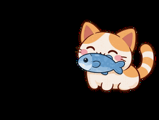

# 状态映射

[返回 README](../README.zh-CN.md)

| 事件 | 状态 | 动画 | Clawd | Calico |
|---|---|---|---|---|
| 无活动 | 待机 | 眼球跟踪 |  |  |
| 无活动（随机） | 待机 | 看书 / 巡逻 |  | |
| UserPromptSubmit | 思考 | 思考泡泡 |  |  |
| PreToolUse / PostToolUse | 工作（打字） | 打字 |  |  |
| PreToolUse（3+ 会话） | 工作（建造） | 建造 |  |  |
| SubagentStart（1 个） | 杂耍 | 杂耍 |  |  |
| SubagentStart（2+） | 指挥 | 指挥 |  |  |
| PostToolUseFailure | 报错 | 报错 |  |  |
| Stop / PostCompact | 注意 | 开心 |  |  |
| PermissionRequest | 通知 | 警报 |  |  |
| PreCompact | 扫地 | 扫地 |  |  |
| WorktreeCreate | 搬运 | 搬箱子 |  |  |
| 60 秒无事件 | 睡觉 | 睡眠 |  |  |

## 极简模式

拖到屏幕右边缘（或右键 →"极简模式"）进入——半身露出在屏幕边缘，悬停时探出来。

| 触发 | 极简反应 | Clawd | Calico |
|---|---|---|---|
| 默认 | 呼吸 + 眨眼 + 眼球追踪 |  |  |
| 鼠标悬停 | 探出身体 + 招手 |  |  |
| 通知 / 权限请求 | 警报弹出 |  |  |
| 任务完成 | 开心庆祝 |  |  |

## 点击反应

彩蛋——试试双击、连点 4 下、或反复戳 Clawd，会有隐藏反应。
